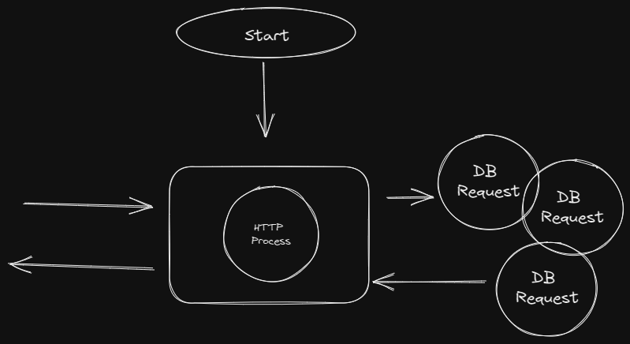
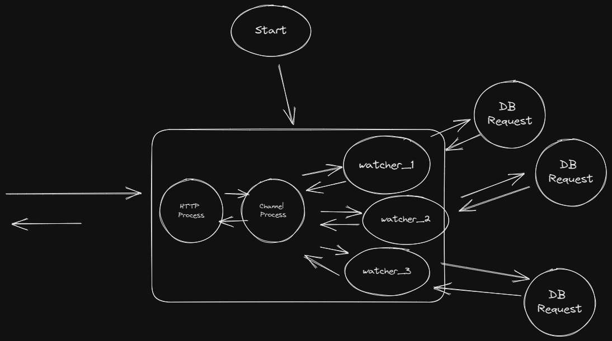

# Canary

Canary is an uptime monitor that leverages the Erlang OTP and Phoenix Liveview for a fault tolerant / real time application.  

# Architecture

To understand the architecture, I think it help to go over what I wanted in an uptime monitor. Canary is primarily used in my home lab to keep track of the online status of my hardware and virtual machines. In addition to checking the status when I visted the website, I also wanted the app to keep track the status while I was away.

Most web frameworks follow the standard request/response model as illustrated in Figure 1 below.




This is your standard web framework that starts an http process that listens for requests. When a request comes in, it gathers the necessary data and presents it back to the user. 

This model makes it difficult to achieve some of the goals of the app. How would we start the processes to monitor each machine? Once we figured that out, how would we monitor and manage the failure of each process. We would also need to figure how to update the frontend with the updated status of each machine. Depending on the number of machines and the interval of data that is being tracked, database calls for historical data could slow down load times. To keep things snappy, we would also need to figure how to run this asynchronously.

Luckily, the Phoenix Framework, built on top of Erlang's OTP, has tools to solve these problems. Canary's architecture looks like this:



What's going on here? First, at start up, Canary starts up a watcher for each machine that is being monitored in addition to the http server and a channel process which we can broacast messages on.

Each watcher pings its machine at a regular interval, inserts a new ping into the database, updates the current state of the pings and broacasts those pings to the appropriate topic on the channel process. Each watcher runs separately and send messages asynchronously so the user doesn't need to wait for all the pings to complete prior to seeing an update.

Canary uses the dynamic supervisor built into OTP in order to keep track of the watcher, restart watchers if they fail and add and delete watchers while the app running. 

Although the architecture adds additional complexity, the end result is a real time, fault tolerant
uptime monitor that uses standard services available through Erlang's VM. 

# Development

To start your Phoenix server:

  * Run `mix setup` to install and setup dependencies
  * Start Phoenix endpoint with `mix phx.server` or inside IEx with `iex -S mix phx.server`

Now you can visit [`localhost:4000`](http://localhost:4000) from your browser.

Ready to run in production? Please [check our deployment guides](https://hexdocs.pm/phoenix/deployment.html).

## Learn more

  * Official website: https://www.phoenixframework.org/
  * Guides: https://hexdocs.pm/phoenix/overview.html
  * Docs: https://hexdocs.pm/phoenix
  * Forum: https://elixirforum.com/c/phoenix-forum
  * Source: https://github.com/phoenixframework/phoenix

## Generated Models

```
mix phx.gen.html Machines Machine machines  name:string ip_address:string payload:map
```
